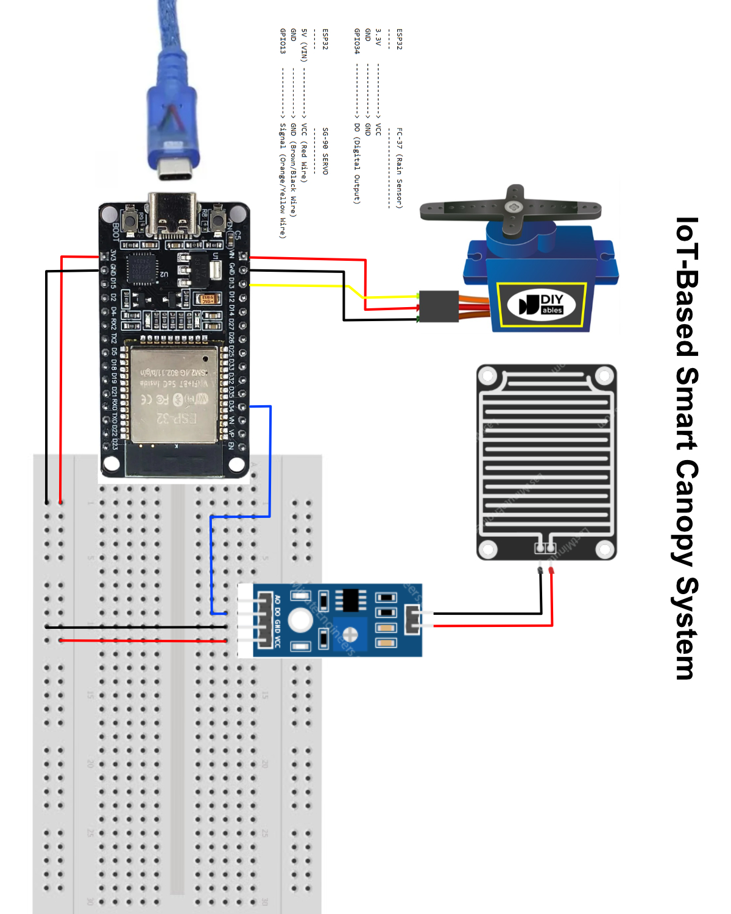
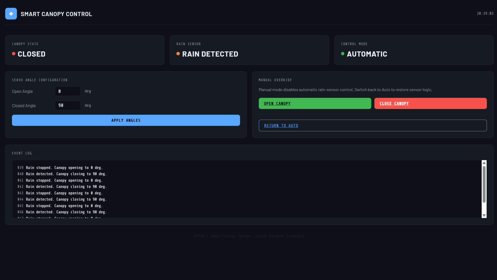

# IoT-Based Smart Canopy System
### Rain Detection Using FC-37 Sensor with SG-90 Servo and Web Dashboard Control

---

## Project Description

This system uses an **ESP32** as the main microcontroller connected to an **FC-37 rain sensor** to detect rainfall. When rain is detected, the **SG-90 servo** will automatically close the canopy. When the rain stops, the canopy will open again automatically. The system provides a **local web dashboard** accessible via browser on the same network, featuring real-time status monitoring, manual override control, servo angle configuration, and an event log.

---

## Required Components

| No | Component | Description |
|----|-----------|-------------|
| 1 | ESP32 | Main microcontroller with built-in WiFi |
| 2 | FC-37 Rain Sensor | Detects the presence of rainwater on the sensor surface |
| 3 | SG-90 Servo | Motor for opening/closing the canopy |
| 4 | Jumper Wires | Connections between components |
| 5 | Adapter & USB Cable | Power supply and program upload |

---

## Wiring / Circuit

### Wiring Diagram



### Connection Diagram

```
ESP32                  FC-37 (Rain Sensor)
-----                  -------------------
3.3V    ------------> VCC
GND     ------------> GND
GPIO34  ------------> DO (Digital Output)


ESP32                  SG-90 SERVO
-----                  -----------
5V (VIN) -----------> VCC (Red Wire)
GND      -----------> GND (Brown/Black Wire)
GPIO13   -----------> Signal (Orange/Yellow Wire)
```

### Detailed Pin Table

| Component | Component Pin | ESP32 Pin |
|-----------|--------------|-----------|
| FC-37 | VCC | 3.3V |
| FC-37 | GND | GND |
| FC-37 | DO | GPIO34 |
| SG-90 Servo | VCC (Red) | 5V (VIN) |
| SG-90 Servo | GND (Brown/Black) | GND |
| SG-90 Servo | Signal (Orange/Yellow) | GPIO13 |

> **Important Notes:**
> - The FC-37 sensor uses **active LOW** logic — the DO output will be **LOW (0)** when **rain is detected**, and **HIGH (1)** when **no rain**. Make sure this matches the FC-37 module you are using.
> - The SG-90 servo requires **5V**. Use the **VIN** pin on the ESP32 (not 3.3V) so the servo moves with sufficient power.
> - If the servo vibrates unstably, try adding a 100µF capacitor between the servo's VCC and GND.

---

## Software Setup

### 1. Install Arduino IDE

- Download: [https://www.arduino.cc/en/software/](https://www.arduino.cc/en/software/)
- Download & Install Tutorial: [https://youtu.be/lTKvZRfJRgw](https://youtu.be/lTKvZRfJRgw)

---

### 2. Install CH340 Driver for ESP32

- Install Tutorial: [https://youtu.be/ctuudlz-d0Q](https://youtu.be/ctuudlz-d0Q)

> **Note:** Make sure to follow the tutorial according to your operating system (Windows/Mac/Linux). After installation, restart your computer if prompted.

---

### 3. Install ESP32 Board in Arduino IDE

- ESP32 Board Install Tutorial: [https://drive.google.com/file/d/1pb8Wt_b7EgaFoNqN1fqX-U0KogYZ6rVh/view?usp=sharing](https://drive.google.com/file/d/1pb8Wt_b7EgaFoNqN1fqX-U0KogYZ6rVh/view?usp=sharing)

> **Note:** Installing the ESP32 board in Arduino IDE may take a bit longer than usual. Please be patient and wait for the process to complete fully.

---

## Required Libraries

Install the following libraries via the Arduino IDE **Library Manager** (`Sketch > Include Library > Manage Libraries`):

| Library | Description |
|---------|-------------|
| `ESP32Servo` | For controlling the servo motor on ESP32 |
| `WiFi` | Already bundled with the ESP32 board, no need to reinstall |
| `WebServer` | Already bundled with the ESP32 board, no need to reinstall |

**How to install:**
1. Open Arduino IDE
2. Click **Sketch** > **Include Library** > **Manage Libraries...**
3. In the search box, type the library name
4. Click **Install**

---

## Program Code

Create a new project in Arduino IDE (`File > New`), then paste the following code:

```cpp
#include <WiFi.h>
#include <WebServer.h>
#include <ESP32Servo.h>

// =============================================
// CONFIGURATION
// =============================================
const char* ssid     = "YOUR_WIFI_NAME";       // Replace with your WiFi SSID
const char* password = "YOUR_WIFI_PASSWORD";   // Replace with your WiFi password

// =============================================
// PIN CONFIGURATION
// =============================================
#define PIN_RAIN_SENSOR  34
#define PIN_SERVO        13

// =============================================
// DEFAULT SERVO ANGLE CONFIGURATION
// =============================================
#define DEFAULT_ANGLE_CLOSED  90
#define DEFAULT_ANGLE_OPEN     0

// =============================================
// VARIABLES
// =============================================
WebServer server(80);
Servo canopyServo;

bool rainActive       = false;
bool manualOverride   = false;   // true = manual mode active
bool manualState      = false;   // true = manually closed, false = manually open

int angleOpen   = DEFAULT_ANGLE_OPEN;
int angleClosed = DEFAULT_ANGLE_CLOSED;

// Last 10 log entries
String eventLog[10];
int logIndex = 0;

void addLog(String msg) {
  eventLog[logIndex % 10] = msg;
  logIndex++;
}

// =============================================
// HTML PAGE
// =============================================
String buildPage() {
  int sensorValue  = digitalRead(PIN_RAIN_SENSOR);
  bool raining     = (sensorValue == LOW);
  bool canopyOpen  = !rainActive && !manualState;

  // Determine displayed state
  String canopyStatus, sensorStatus, modeStatus;
  canopyStatus = canopyOpen ? "OPEN" : "CLOSED";
  sensorStatus = raining    ? "RAIN DETECTED" : "CLEAR";
  modeStatus   = manualOverride ? "MANUAL" : "AUTOMATIC";

  String page = R"rawhtml(
<!DOCTYPE html>
<html lang="en">
<head>
  <meta charset="UTF-8">
  <meta name="viewport" content="width=device-width, initial-scale=1.0">
  <title>Smart Canopy Control</title>
  <link rel="preconnect" href="https://fonts.googleapis.com">
  <link href="https://fonts.googleapis.com/css2?family=Share+Tech+Mono&family=Barlow:wght@300;400;600;700&display=swap" rel="stylesheet">
  <style>
    :root {
      --bg:         #0d1117;
      --surface:    #161b22;
      --border:     #21262d;
      --accent:     #58a6ff;
      --accent2:    #3fb950;
      --warn:       #f0883e;
      --danger:     #f85149;
      --text:       #e6edf3;
      --muted:      #8b949e;
      --mono:       'Share Tech Mono', monospace;
      --sans:       'Barlow', sans-serif;
    }

    * { box-sizing: border-box; margin: 0; padding: 0; }

    body {
      background: var(--bg);
      color: var(--text);
      font-family: var(--sans);
      min-height: 100vh;
      padding: 24px 16px;
    }

    header {
      display: flex;
      align-items: center;
      gap: 12px;
      margin-bottom: 32px;
      border-bottom: 1px solid var(--border);
      padding-bottom: 16px;
    }

    header .logo {
      width: 36px; height: 36px;
      background: var(--accent);
      border-radius: 8px;
      display: flex; align-items: center; justify-content: center;
      font-size: 18px;
    }

    header h1 {
      font-size: 1.1rem;
      font-weight: 600;
      letter-spacing: 0.05em;
      text-transform: uppercase;
    }

    header span {
      font-family: var(--mono);
      font-size: 0.75rem;
      color: var(--muted);
      margin-left: auto;
    }

    .grid {
      display: grid;
      grid-template-columns: repeat(auto-fit, minmax(260px, 1fr));
      gap: 16px;
      margin-bottom: 20px;
    }

    .card {
      background: var(--surface);
      border: 1px solid var(--border);
      border-radius: 10px;
      padding: 20px;
    }

    .card-label {
      font-family: var(--mono);
      font-size: 0.65rem;
      letter-spacing: 0.12em;
      text-transform: uppercase;
      color: var(--muted);
      margin-bottom: 10px;
    }

    .status-badge {
      display: inline-flex;
      align-items: center;
      gap: 8px;
      font-size: 1.4rem;
      font-weight: 700;
      letter-spacing: 0.04em;
    }

    .dot {
      width: 10px; height: 10px;
      border-radius: 50%;
      animation: pulse 2s infinite;
    }

    @keyframes pulse {
      0%, 100% { opacity: 1; }
      50%       { opacity: 0.4; }
    }

    .dot-open   { background: var(--accent2); }
    .dot-closed { background: var(--danger); }
    .dot-clear  { background: var(--accent); }
    .dot-rain   { background: var(--warn); }
    .dot-auto   { background: var(--accent2); }
    .dot-manual { background: var(--warn); }

    /* Angle Config */
    .angle-row {
      display: flex;
      align-items: center;
      gap: 12px;
      margin-bottom: 14px;
    }

    .angle-row label {
      font-size: 0.82rem;
      color: var(--muted);
      width: 120px;
      flex-shrink: 0;
    }

    .angle-row input[type=number] {
      width: 80px;
      background: var(--bg);
      border: 1px solid var(--border);
      border-radius: 6px;
      color: var(--text);
      font-family: var(--mono);
      font-size: 0.9rem;
      padding: 6px 10px;
      outline: none;
      transition: border-color 0.2s;
    }

    .angle-row input[type=number]:focus {
      border-color: var(--accent);
    }

    .angle-row .unit {
      font-family: var(--mono);
      font-size: 0.75rem;
      color: var(--muted);
    }

    /* Buttons */
    .btn-row {
      display: flex;
      gap: 10px;
      flex-wrap: wrap;
      margin-top: 4px;
    }

    .btn {
      flex: 1;
      min-width: 100px;
      padding: 10px 16px;
      border: none;
      border-radius: 7px;
      font-family: var(--mono);
      font-size: 0.78rem;
      letter-spacing: 0.06em;
      text-transform: uppercase;
      cursor: pointer;
      transition: opacity 0.15s, transform 0.1s;
    }

    .btn:active { transform: scale(0.97); }

    .btn-primary {
      background: var(--accent);
      color: #000;
      font-weight: 700;
    }

    .btn-open {
      background: var(--accent2);
      color: #000;
      font-weight: 700;
    }

    .btn-close-canopy {
      background: var(--danger);
      color: #fff;
      font-weight: 700;
    }

    .btn-auto {
      background: transparent;
      border: 1px solid var(--accent);
      color: var(--accent);
    }

    .btn:hover { opacity: 0.85; }

    /* Log */
    .log-box {
      background: var(--bg);
      border: 1px solid var(--border);
      border-radius: 8px;
      padding: 14px 16px;
      font-family: var(--mono);
      font-size: 0.72rem;
      color: var(--muted);
      max-height: 180px;
      overflow-y: auto;
      line-height: 1.7;
    }

    .log-box .entry { color: var(--text); }
    .log-box .entry span { color: var(--muted); margin-right: 8px; }

    footer {
      text-align: center;
      margin-top: 28px;
      font-family: var(--mono);
      font-size: 0.65rem;
      color: var(--border);
      letter-spacing: 0.08em;
    }

    .section-title {
      font-family: var(--mono);
      font-size: 0.65rem;
      letter-spacing: 0.12em;
      text-transform: uppercase;
      color: var(--muted);
      margin-bottom: 14px;
    }

    .divider {
      border: none;
      border-top: 1px solid var(--border);
      margin: 16px 0;
    }
  </style>
</head>
<body>

<header>
  <div class="logo">&#9670;</div>
  <h1>Smart Canopy Control</h1>
  <span id="clock">--:--:--</span>
</header>

<!-- Status Cards -->
<div class="grid">
  <div class="card">
    <div class="card-label">Canopy State</div>
    <div class="status-badge">
)rawhtml";

  page += "<div class='dot dot-" + String(canopyOpen ? "open" : "closed") + "'></div>";
  page += "<span>" + canopyStatus + "</span>";

  page += R"rawhtml(
    </div>
  </div>
  <div class="card">
    <div class="card-label">Rain Sensor</div>
    <div class="status-badge">
)rawhtml";

  page += "<div class='dot dot-" + String(raining ? "rain" : "clear") + "'></div>";
  page += "<span>" + sensorStatus + "</span>";

  page += R"rawhtml(
    </div>
  </div>
  <div class="card">
    <div class="card-label">Control Mode</div>
    <div class="status-badge">
)rawhtml";

  page += "<div class='dot dot-" + String(manualOverride ? "manual" : "auto") + "'></div>";
  page += "<span>" + modeStatus + "</span>";

  page += R"rawhtml(
    </div>
  </div>
</div>

<!-- Angle Config + Manual Control -->
<div class="grid">

  <!-- Angle Configuration -->
  <div class="card">
    <div class="section-title">Servo Angle Configuration</div>
    <form action="/setangles" method="GET">
      <div class="angle-row">
        <label>Open Angle</label>
        <input type="number" name="open" min="0" max="180" value=")rawhtml";
  page += String(angleOpen);
  page += R"rawhtml(">
        <span class="unit">deg</span>
      </div>
      <div class="angle-row">
        <label>Closed Angle</label>
        <input type="number" name="closed" min="0" max="180" value=")rawhtml";
  page += String(angleClosed);
  page += R"rawhtml(">
        <span class="unit">deg</span>
      </div>
      <div class="btn-row">
        <button type="submit" class="btn btn-primary">Apply Angles</button>
      </div>
    </form>
  </div>

  <!-- Manual Control -->
  <div class="card">
    <div class="section-title">Manual Override</div>
    <p style="font-size:0.8rem; color:var(--muted); margin-bottom:16px; line-height:1.5;">
      Manual mode disables automatic rain-sensor control.
      Switch back to Auto to restore sensor logic.
    </p>
    <div class="btn-row">
      <a href="/manual/open"  class="btn btn-open">Open Canopy</a>
      <a href="/manual/close" class="btn btn-close-canopy">Close Canopy</a>
    </div>
    <hr class="divider">
    <div class="btn-row">
      <a href="/auto" class="btn btn-auto">Return to Auto</a>
    </div>
  </div>

</div>

<!-- Event Log -->
<div class="card">
  <div class="section-title">Event Log</div>
  <div class="log-box">
)rawhtml";

  // Print log entries newest first
  int total = logIndex < 10 ? logIndex : 10;
  if (total == 0) {
    page += "<div style='color:var(--muted)'>No events recorded yet.</div>";
  } else {
    for (int i = total - 1; i >= 0; i--) {
      int idx = (logIndex - 1 - i + 10) % 10;
      if (logIndex > 10) idx = (logIndex - 1 - i) % 10;
      page += "<div class='entry'><span>#" + String(logIndex - i) + "</span>" + eventLog[idx] + "</div>";
    }
  }

  page += R"rawhtml(
  </div>
</div>

<footer>ESP32 &mdash; Smart Canopy System &mdash; Local Network Interface</footer>

<script>
  // Live clock
  function tick() {
    const d = new Date();
    const pad = n => String(n).padStart(2,'0');
    document.getElementById('clock').textContent =
      pad(d.getHours()) + ':' + pad(d.getMinutes()) + ':' + pad(d.getSeconds());
  }
  tick();
  setInterval(tick, 1000);

  // Auto-refresh page every 5 seconds to reflect sensor state
  setTimeout(() => location.reload(), 5000);
</script>
</body>
</html>
)rawhtml";

  return page;
}

// =============================================
// ROUTE HANDLERS
// =============================================
void handleRoot() {
  server.send(200, "text/html", buildPage());
}

void handleSetAngles() {
  if (server.hasArg("open") && server.hasArg("closed")) {
    int newOpen   = server.arg("open").toInt();
    int newClosed = server.arg("closed").toInt();

    // Clamp to valid servo range
    if (newOpen   < 0) newOpen   = 0;
    if (newOpen   > 180) newOpen = 180;
    if (newClosed < 0) newClosed = 0;
    if (newClosed > 180) newClosed = 180;

    angleOpen   = newOpen;
    angleClosed = newClosed;

    addLog("Angle config updated: open=" + String(angleOpen) + " deg, closed=" + String(angleClosed) + " deg");
    Serial.println("Angles updated: open=" + String(angleOpen) + " closed=" + String(angleClosed));
  }
  server.sendHeader("Location", "/");
  server.send(302, "text/plain", "");
}

void handleManualOpen() {
  manualOverride = true;
  manualState    = false;
  canopyServo.write(angleOpen);
  addLog("Manual command: canopy OPEN at " + String(angleOpen) + " deg");
  Serial.println("Manual OPEN");
  server.sendHeader("Location", "/");
  server.send(302, "text/plain", "");
}

void handleManualClose() {
  manualOverride = true;
  manualState    = true;
  canopyServo.write(angleClosed);
  addLog("Manual command: canopy CLOSED at " + String(angleClosed) + " deg");
  Serial.println("Manual CLOSE");
  server.sendHeader("Location", "/");
  server.send(302, "text/plain", "");
}

void handleAuto() {
  manualOverride = false;
  addLog("Control mode switched to AUTOMATIC");
  Serial.println("Switched to AUTO mode");
  server.sendHeader("Location", "/");
  server.send(302, "text/plain", "");
}

void handleNotFound() {
  server.send(404, "text/plain", "404 Not Found");
}

// =============================================
// SETUP
// =============================================
void setup() {
  Serial.begin(115200);

  pinMode(PIN_RAIN_SENSOR, INPUT);

  canopyServo.attach(PIN_SERVO);
  canopyServo.write(angleOpen);
  delay(500);

  // Connect to WiFi
  Serial.print("Connecting to WiFi");
  WiFi.begin(ssid, password);
  while (WiFi.status() != WL_CONNECTED) {
    delay(500);
    Serial.print(".");
  }
  Serial.println("\nWiFi Connected!");
  Serial.print("IP Address: ");
  Serial.println(WiFi.localIP());

  // Register routes
  server.on("/",             handleRoot);
  server.on("/setangles",    handleSetAngles);
  server.on("/manual/open",  handleManualOpen);
  server.on("/manual/close", handleManualClose);
  server.on("/auto",         handleAuto);
  server.onNotFound(handleNotFound);

  server.begin();
  Serial.println("Web server started.");
  addLog("System started. Canopy open at " + String(angleOpen) + " deg.");
}

// =============================================
// LOOP
// =============================================
void loop() {
  server.handleClient();

  // Only apply sensor logic when not in manual override
  if (!manualOverride) {
    int sensorValue = digitalRead(PIN_RAIN_SENSOR);

    if (sensorValue == LOW) {
      // Rain detected
      if (!rainActive) {
        canopyServo.write(angleClosed);
        Serial.println("Rain detected. Closing canopy.");
        addLog("Rain detected. Canopy closing to " + String(angleClosed) + " deg.");
        rainActive = true;
      }
    } else {
      // No rain
      if (rainActive) {
        canopyServo.write(angleOpen);
        Serial.println("Rain stopped. Opening canopy.");
        addLog("Rain stopped. Canopy opening to " + String(angleOpen) + " deg.");
        rainActive = false;
      }
    }
  }

  delay(100);
}
```

> **Before uploading, make sure you have replaced:**
> - `YOUR_WIFI_NAME` with your WiFi SSID
> - `YOUR_WIFI_PASSWORD` with your WiFi password

> **Servo Calibration:** The `DEFAULT_ANGLE_CLOSED` and `DEFAULT_ANGLE_OPEN` values can be adjusted (0-180) depending on the mechanical construction of your canopy. These can also be changed at runtime through the web dashboard without re-uploading the code.

---

## How to Upload the Program to ESP32

1. **Make sure the ESP32 is connected** to your laptop/PC via USB cable.

2. **Configure the Board:**
   - Click the **Tools** menu in Arduino IDE
   - Go to **Board** > **esp32** > select **ESP32 Dev Module**

3. **Configure the Port:**
   - Click the **Tools** menu again
   - Go to **Port**
   - Select the port connected to the ESP32 (e.g., `COM8` on Windows, `/dev/ttyUSB0` on Linux/Mac)

4. **Upload the Program:**
   - Press **Ctrl+U** to start the upload

---

### Upload Troubleshooting

| Problem | Solution |
|---------|----------|
| Upload fails | The selected Port may be wrong. Try selecting a different available port. |
| Still fails after changing port | Press **Ctrl+U** and **hold the BOOT button** on the ESP32 simultaneously. The ESP32 usually requires this on the first program upload. |
| Still failing | Read the error message in the Arduino IDE **Output** window for further guidance. |

---

## Accessing the Web Dashboard

After the program is successfully uploaded and running, the ESP32 hosts a local web server that can be accessed from any device on the same network.

### Web Dashboard Display



### Requirements

- The device used to access the dashboard (laptop, phone, or tablet) **must be connected to the same WiFi network or hotspot** as the ESP32.
- The ESP32 does **not** support 5 GHz WiFi. Use a **2.4 GHz** network or hotspot.
- If using a mobile hotspot, make sure mobile data is active and the hotspot is broadcasting on the 2.4 GHz band.

### Steps to Open the Dashboard

1. **Upload and run the program** on the ESP32.

2. **Open the Serial Monitor** in Arduino IDE:
   - Click **Tools** > **Serial Monitor**, or press **Ctrl+Shift+M**
   - Set the baud rate to **115200**

3. **Find the IP address** — after the ESP32 connects to WiFi, the Serial Monitor will display output similar to the following:
   ```
   WiFi Connected!
   IP Address: 192.168.1.105
   Web server started.
   ```

4. **Open a browser** on any device connected to the same network.

5. **Type the IP address** shown in the Serial Monitor into the browser address bar. For example:
   ```
   192.168.1.105
   ```

6. The **Smart Canopy Control** dashboard will load in the browser.

> **Note:** The IP address may change each time the ESP32 reconnects to the network, depending on your router's DHCP settings. Always check the Serial Monitor for the current IP address after each restart.

---

## Web Dashboard Features

| Feature | Description |
|---------|-------------|
| Canopy State | Shows whether the canopy is currently OPEN or CLOSED |
| Rain Sensor | Shows current sensor reading (CLEAR or RAIN DETECTED) |
| Control Mode | Shows whether the system is in AUTOMATIC or MANUAL mode |
| Servo Angle Configuration | Set custom open and closed angles (0-180 degrees) without re-uploading code |
| Manual Override | Manually open or close the canopy regardless of sensor state |
| Return to Auto | Disables manual override and restores automatic sensor-based control |
| Event Log | Displays the last 10 system events with sequence numbers |
| Auto-refresh | The page refreshes automatically every 5 seconds to reflect current sensor state |

---

## System Flow

```
[FC-37 Rain Sensor]
        |
        | (Digital signal LOW when raining)
        |
        v
[ESP32]
        |
        |-- Move SERVO to CLOSED position (default 90 deg)
        |
        |-- Log event to Event Log
        |
        v
[Web Dashboard] -- accessible via browser on same network

When rain stops:
[FC-37] HIGH --> [ESP32] --> Servo OPEN (default 0 deg) + event logged

Manual override:
[Web Dashboard] --> [ESP32] --> Servo moves to commanded position
                             --> Sensor logic suspended until Auto is restored
```

---

## Connection Tips

- Make sure the ESP32 is within a **stable WiFi signal range**.
- Use a **2.4 GHz** WiFi network (ESP32 does not support 5 GHz).
- If using a mobile hotspot, make sure mobile data is active and stable.
- Make sure the FC-37 sensor is **installed outdoors** and can be directly exposed to rainwater.
- The web dashboard and the accessing device must be on the **same local network**.

---

## Project Structure

```
Smart-Canopy-IoT/
|
+-- README.md                  <- This documentation
+-- img/
|   +-- Image_2.jpg            <- Wiring diagram
|   +-- web_canopy.png         <- Web dashboard screenshot
+-- smart_canopy/
    +-- smart_canopy.ino       <- Arduino program code
```

---

## References & Important Links

| Source | Link |
|--------|------|
| Arduino IDE | https://www.arduino.cc/en/software/ |
| Arduino IDE Install Tutorial | https://youtu.be/lTKvZRfJRgw |
| CH340 Driver Install Tutorial | https://youtu.be/ctuudlz-d0Q |
| ESP32 Board Install Tutorial | https://drive.google.com/file/d/1pb8Wt_b7EgaFoNqN1fqX-U0KogYZ6rVh/view?usp=sharing |

---

> Created for an IoT-based automatic canopy system using ESP32, FC-37 Rain Sensor, SG-90 Servo, and local Web Dashboard.
