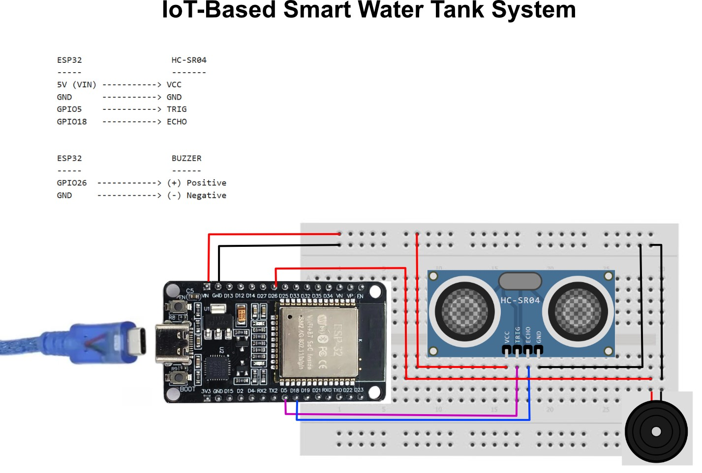

# IoT-Based Smart Water Tank System
### Water Level Monitoring Using HC-SR04 Sensor, Buzzer, and Web-Based Dashboard

---

## Project Description

This system uses an **ESP32** as the main microcontroller connected to an **HC-SR04 ultrasonic sensor** to measure the water surface distance inside the tank. The system continuously monitors the water level and classifies it into three states:

- **OVERFULL** — the sensor-to-water distance is less than or equal to the Full Limit threshold
- **NORMAL** — the distance is between the Full Limit and the Low Limit
- **LOW** — the sensor-to-water distance is greater than or equal to the Low Limit threshold

When the water is in the **OVERFULL** or **LOW** state, a **buzzer** sounds as a local alarm. All readings, fill percentage, and state history are accessible in real time through a **web-based dashboard** served directly by the ESP32 over the local network. Thresholds can be adjusted live through the web interface without re-uploading the program.

> **Working Principle:** The HC-SR04 sensor is mounted at the top of the tank, facing downward. The greater the measured distance, the less water is in the tank. The system maps this distance to a fill percentage and determines the current state based on two configurable thresholds.

---

## Required Components

| No | Component | Description |
|----|-----------|-------------|
| 1 | ESP32 | Main microcontroller with built-in WiFi |
| 2 | HC-SR04 Sensor | Ultrasonic sensor for measuring water surface distance |
| 3 | Buzzer | Audible alarm for OVERFULL and LOW states |
| 4 | Jumper Wires | Connections between components |
| 5 | Adapter & USB Cable | Power supply and program upload |

---

## Wiring / Circuit

### Wiring Diagram



### Connection Diagram

```
ESP32                  HC-SR04
-----                  -------
5V (VIN) -----------> VCC
GND      -----------> GND
GPIO5    -----------> TRIG
GPIO18   -----------> ECHO


ESP32                  BUZZER
-----                  ------
GPIO26  ------------> (+) Positive
GND     ------------> (-) Negative
```

### Detailed Pin Table

| Component | Component Pin | ESP32 Pin |
|-----------|--------------|-----------|
| HC-SR04 | VCC | 5V (VIN) |
| HC-SR04 | GND | GND |
| HC-SR04 | TRIG | GPIO5 |
| HC-SR04 | ECHO | GPIO18 |
| Buzzer | (+) Positive | GPIO26 |
| Buzzer | (-) Negative | GND |

> **Important Notes:**
> - The HC-SR04 sensor requires **5V**. Use the **VIN** pin on the ESP32 (not 3.3V).
> - The **ECHO** pin on the HC-SR04 outputs a **5V** signal, while the ESP32 is only **3.3V** tolerant. For safety, it is recommended to use a **voltage divider** on the ECHO pin using **1kΩ** and **2kΩ** resistors before connecting to GPIO18. However, in simple practice, direct connections often work — use at your own risk.
> - Mount the sensor **at the top of the tank**, facing downward toward the water surface.
> - Ensure there are no obstacles between the sensor and the water surface.

### ECHO Voltage Divider Schematic (Optional but Recommended)

```
HC-SR04 ECHO (5V) ---[1kΩ]---+---[2kΩ]--- GND
                               |
                            GPIO18 ESP32 (~3.3V)
```

---

## Software Setup

### 1. Install Arduino IDE

- Download: [https://www.arduino.cc/en/software/](https://www.arduino.cc/en/software/)
- Download & Install Tutorial: [https://youtu.be/lTKvZRfJRgw](https://youtu.be/lTKvZRfJRgw)

---

### 2. Install CH340 Driver for ESP32

The ESP32 board used in this project uses the **CH340** USB-to-serial chip. You must install the correct driver before the computer can recognize the board.

- CH340 Driver Install Tutorial: [https://youtu.be/ctuudlz-d0Q](https://youtu.be/ctuudlz-d0Q)

> **Note:** After installing the driver, reconnect the ESP32 via USB and check that a new COM port appears under **Device Manager** (Windows) or `/dev/ttyUSB0` (Linux/Mac) before proceeding.

---

### 3. Install ESP32 Board in Arduino IDE

- ESP32 Board Install Tutorial: [https://drive.google.com/file/d/1pb8Wt_b7EgaFoNqN1fqX-U0KogYZ6rVh/view?usp=sharing](https://drive.google.com/file/d/1pb8Wt_b7EgaFoNqN1fqX-U0KogYZ6rVh/view?usp=sharing)

> **Note:** Installing the ESP32 board in Arduino IDE may take longer than usual. Please be patient and wait for the process to complete fully before continuing.

---

## Required Libraries

The new code uses only libraries that are already bundled with the ESP32 board package. No additional library installation is required.

| Library | Description |
|---------|-------------|
| `WiFi` | Built-in with ESP32 board package |
| `WebServer` | Built-in with ESP32 board package |

> The HC-SR04 sensor is controlled directly using Arduino's built-in `pulseIn()` function — no additional library is needed.

---

## Program Code

Create a new project in Arduino IDE (`File > New`), then paste the following code:

```cpp
#include <WiFi.h>
#include <WebServer.h>

// =============================================
// CONFIGURATION
// =============================================
const char* ssid     = "YOUR_WIFI_NAME";       // Replace with your WiFi SSID
const char* password = "YOUR_WIFI_PASSWORD";   // Replace with your WiFi password

// =============================================
// PIN CONFIGURATION
// =============================================
#define PIN_TRIG    5
#define PIN_ECHO    18
#define PIN_BUZZER  26

// =============================================
// DEFAULT DISTANCE THRESHOLD CONFIGURATION
// =============================================
int DISTANCE_FULL_CM = 5;   // <= this → OVERFULL
int DISTANCE_LOW_CM  = 25;  // >= this → LOW
// Normal: between FULL+1 and LOW-1

// =============================================
// VARIABLES
// =============================================
WebServer server(80);

typedef enum {
  STATE_UNKNOWN,
  STATE_OVERFULL,
  STATE_NORMAL,
  STATE_LOW
} WaterState;

WaterState currentState  = STATE_UNKNOWN;
WaterState previousState = STATE_UNKNOWN;

float lastDistance       = -1;
unsigned long lastMeasure = 0;
const unsigned long MEASURE_INTERVAL = 1000;

// Event log
String eventLog[12];
int logIndex = 0;

void addLog(String msg) {
  eventLog[logIndex % 12] = msg;
  logIndex++;
}

// =============================================
// HC-SR04 DISTANCE READ
// =============================================
float readDistance() {
  digitalWrite(PIN_TRIG, LOW);
  delayMicroseconds(2);
  digitalWrite(PIN_TRIG, HIGH);
  delayMicroseconds(10);
  digitalWrite(PIN_TRIG, LOW);
  long duration = pulseIn(PIN_ECHO, HIGH, 30000);
  if (duration == 0) return -1;
  return (duration / 2.0) / 29.1;
}

WaterState getWaterState(float distance) {
  if (distance < 0)                        return STATE_UNKNOWN;
  if (distance <= DISTANCE_FULL_CM)        return STATE_OVERFULL;
  if (distance >= DISTANCE_LOW_CM)         return STATE_LOW;
  return STATE_NORMAL;
}

// =============================================
// COMPUTE FILL PERCENTAGE
// distance = FULL_CM      → 100%
// distance = LOW_CM       → 0%
// =============================================
int fillPercent(float dist) {
  if (dist < 0) return 0;
  float span = (float)(DISTANCE_LOW_CM - DISTANCE_FULL_CM);
  if (span <= 0) span = 1;
  float pct = ((DISTANCE_LOW_CM - dist) / span) * 100.0;
  if (pct < 0)   pct = 0;
  if (pct > 100) pct = 100;
  return (int)pct;
}

// =============================================
// JSON API  /api/data
// =============================================
void handleApiData() {
  String stateStr;
  switch (currentState) {
    case STATE_OVERFULL: stateStr = "OVERFULL"; break;
    case STATE_NORMAL:   stateStr = "NORMAL";   break;
    case STATE_LOW:      stateStr = "LOW";       break;
    default:             stateStr = "UNKNOWN";
  }

  String json = "{";
  json += "\"distance\":" + String(lastDistance, 1) + ",";
  json += "\"fill_pct\":" + String(fillPercent(lastDistance)) + ",";
  json += "\"state\":\"" + stateStr + "\",";
  json += "\"full_cm\":" + String(DISTANCE_FULL_CM) + ",";
  json += "\"low_cm\":"  + String(DISTANCE_LOW_CM)  + ",";
  json += "\"log\":[";
  int total = logIndex < 12 ? logIndex : 12;
  for (int i = total - 1; i >= 0; i--) {
    int idx = (logIndex - 1 - i + 12) % 12;
    if (logIndex > 12) idx = (logIndex - 1 - i + 12) % 12;
    if (i < total - 1) json += ",";
    json += "\"" + eventLog[idx] + "\"";
  }
  json += "]}";

  server.sendHeader("Access-Control-Allow-Origin", "*");
  server.send(200, "application/json", json);
}

// =============================================
// SET THRESHOLDS  /setthresh?full=X&low=Y
// =============================================
void handleSetThresh() {
  if (server.hasArg("full") && server.hasArg("low")) {
    int nf = server.arg("full").toInt();
    int nl = server.arg("low").toInt();
    if (nf < 1)   nf = 1;
    if (nf > 200) nf = 200;
    if (nl < 1)   nl = 1;
    if (nl > 400) nl = 400;
    if (nl <= nf) nl = nf + 1;
    DISTANCE_FULL_CM = nf;
    DISTANCE_LOW_CM  = nl;
    addLog("Thresholds updated: full<=" + String(nf) + "cm, low>=" + String(nl) + "cm");
    Serial.println("Thresholds updated: full=" + String(nf) + " low=" + String(nl));
  }
  server.sendHeader("Location", "/");
  server.send(302, "text/plain", "");
}

// =============================================
// HTML PAGE
// =============================================
void handleRoot() {
  String html = R"rawhtml(
<!DOCTYPE html>
<html lang="en">
<head>
<meta charset="UTF-8">
<meta name="viewport" content="width=device-width,initial-scale=1">
<title>Water Tank Monitor</title>
<link rel="preconnect" href="https://fonts.googleapis.com">
<link href="https://fonts.googleapis.com/css2?family=Instrument+Serif:ital@0;1&family=DM+Mono:wght@300;400;500&display=swap" rel="stylesheet">
<style>
:root{
  --bg:        #f0f4f8;
  --surface:   #ffffff;
  --ink:       #1a2332;
  --muted:     #7a8b9a;
  --border:    #dde3ea;
  --water-low:    #e84545;
  --water-normal: #2196f3;
  --water-full:   #ff9800;
  --water-unknown:#aab5c0;
  --serif: 'Instrument Serif', Georgia, serif;
  --mono:  'DM Mono', monospace;
}
*{box-sizing:border-box;margin:0;padding:0}
body{
  background:var(--bg);
  color:var(--ink);
  font-family:var(--mono);
  min-height:100vh;
  padding:28px 20px 40px;
}

/* ---- Header ---- */
header{
  display:flex;align-items:baseline;gap:14px;
  margin-bottom:32px;
  border-bottom:2px solid var(--ink);
  padding-bottom:14px;
}
header h1{
  font-family:var(--serif);
  font-size:2rem;
  font-weight:400;
  letter-spacing:-0.02em;
}
header .sub{
  font-size:0.7rem;
  color:var(--muted);
  letter-spacing:0.12em;
  text-transform:uppercase;
  flex:1;
}
header .clock{
  font-size:0.75rem;
  color:var(--muted);
  font-variant-numeric:tabular-nums;
}

/* ---- Layout ---- */
.layout{
  display:grid;
  grid-template-columns:1fr 320px;
  gap:20px;
  align-items:start;
}
@media(max-width:760px){
  .layout{grid-template-columns:1fr}
}

/* ---- Cards ---- */
.card{
  background:var(--surface);
  border:1px solid var(--border);
  border-radius:12px;
  padding:24px;
}
.card-label{
  font-size:0.62rem;
  letter-spacing:0.14em;
  text-transform:uppercase;
  color:var(--muted);
  margin-bottom:14px;
}

/* ---- Tank SVG wrapper ---- */
.tank-wrap{
  display:flex;
  flex-direction:column;
  align-items:center;
  gap:18px;
  padding:28px 0 16px;
}

/* ---- Distance readout ---- */
.distance-big{
  font-family:var(--serif);
  font-size:3.8rem;
  line-height:1;
  text-align:center;
  transition:color 0.4s;
}
.distance-big span{
  font-size:1.2rem;
  font-family:var(--mono);
  color:var(--muted);
  margin-left:4px;
}

/* ---- State badge ---- */
.state-badge{
  display:inline-flex;
  align-items:center;
  gap:8px;
  padding:6px 14px;
  border-radius:99px;
  font-size:0.72rem;
  font-weight:500;
  letter-spacing:0.1em;
  text-transform:uppercase;
  transition:background 0.4s, color 0.4s;
}
.state-badge .dot{
  width:8px;height:8px;border-radius:50%;
  animation:blink 1.6s ease-in-out infinite;
}
@keyframes blink{0%,100%{opacity:1}50%{opacity:0.3}}

.badge-NORMAL  {background:#e3f2fd;color:#1565c0}
.badge-NORMAL  .dot{background:#2196f3}
.badge-OVERFULL{background:#fff3e0;color:#bf360c}
.badge-OVERFULL .dot{background:#ff9800}
.badge-LOW     {background:#fce4ec;color:#880e4f}
.badge-LOW     .dot{background:#e84545}
.badge-UNKNOWN {background:#eceff1;color:#546e7a}
.badge-UNKNOWN .dot{background:#aab5c0}

/* ---- Threshold markers on right panel ---- */
.thresh-section{margin-bottom:20px}
.thresh-row{
  display:flex;align-items:center;gap:10px;
  margin-bottom:10px;
}
.thresh-row label{
  font-size:0.72rem;
  color:var(--muted);
  width:90px;flex-shrink:0;
}
.thresh-row input[type=number]{
  width:72px;
  border:1px solid var(--border);
  border-radius:6px;
  padding:6px 8px;
  font-family:var(--mono);
  font-size:0.82rem;
  color:var(--ink);
  background:var(--bg);
  outline:none;
  transition:border-color 0.2s;
}
.thresh-row input[type=number]:focus{border-color:var(--ink)}
.thresh-row .unit{font-size:0.7rem;color:var(--muted)}

.btn-apply{
  width:100%;
  padding:10px;
  background:var(--ink);
  color:#fff;
  border:none;border-radius:7px;
  font-family:var(--mono);
  font-size:0.72rem;
  letter-spacing:0.1em;
  text-transform:uppercase;
  cursor:pointer;
  transition:opacity 0.15s;
  margin-top:4px;
}
.btn-apply:hover{opacity:0.8}
.btn-apply:active{transform:scale(0.98)}

/* ---- Divider ---- */
hr{border:none;border-top:1px solid var(--border);margin:18px 0}

/* ---- Log ---- */
.log-box{
  background:var(--bg);
  border:1px solid var(--border);
  border-radius:8px;
  padding:12px 14px;
  font-size:0.68rem;
  color:var(--muted);
  max-height:160px;
  overflow-y:auto;
  line-height:1.8;
}
.log-box .le{color:var(--ink)}
.log-box .le em{color:var(--muted);font-style:normal;margin-right:6px}

/* ---- Fill % bar ---- */
.fill-bar-wrap{width:100%;background:var(--border);border-radius:99px;height:6px;margin-top:6px}
.fill-bar{height:6px;border-radius:99px;transition:width 0.6s,background 0.4s}

footer{
  text-align:center;
  margin-top:32px;
  font-size:0.62rem;
  color:var(--border);
  letter-spacing:0.1em;
  text-transform:uppercase;
}
</style>
</head>
<body>

<header>
  <h1>Water Tank Monitor</h1>
  <span class="sub">HC-SR04 / ESP32 / Local Network</span>
  <span class="clock" id="clk">--:--:--</span>
</header>

<div class="layout">

  <!-- LEFT: Tank visualization -->
  <div class="card">
    <div class="card-label">Live Tank Level</div>
    <div class="tank-wrap">

      <!-- Animated SVG Tank -->
      <svg id="tankSvg" viewBox="0 0 220 320" width="180" xmlns="http://www.w3.org/2000/svg" style="overflow:visible">
        <defs>
          <clipPath id="tankClip">
            <rect x="20" y="30" width="180" height="260" rx="12"/>
          </clipPath>
          <!-- wave pattern -->
          <pattern id="wavePattern" x="0" y="0" width="80" height="20" patternUnits="userSpaceOnUse">
            <path d="M0,10 Q20,0 40,10 Q60,20 80,10" fill="none" stroke="rgba(255,255,255,0.25)" stroke-width="2">
              <animateTransform attributeName="patternTransform" type="translate" from="0 0" to="80 0" dur="2.4s" repeatCount="indefinite"/>
            </path>
          </pattern>
          <linearGradient id="waterGrad" x1="0" y1="0" x2="0" y2="1">
            <stop offset="0%" id="wg0" stop-color="#64b5f6"/>
            <stop offset="100%" id="wg1" stop-color="#1565c0"/>
          </linearGradient>
        </defs>

        <!-- Tank body background -->
        <rect x="20" y="30" width="180" height="260" rx="12" fill="#eef2f7" stroke="#c5d0da" stroke-width="2"/>

        <!-- Water fill (animated height) -->
        <g clip-path="url(#tankClip)">
          <rect id="waterFill" x="20" y="290" width="180" height="0"
                fill="url(#waterGrad)" style="transition:y 0.8s cubic-bezier(.4,0,.2,1),height 0.8s cubic-bezier(.4,0,.2,1)"/>
          <!-- wave overlay on top of fill -->
          <rect id="waveOverlay" x="20" y="290" width="180" height="20" fill="url(#wavePattern)"
                style="transition:y 0.8s cubic-bezier(.4,0,.2,1)"/>
        </g>

        <!-- Tank border front -->
        <rect x="20" y="30" width="180" height="260" rx="12" fill="none" stroke="#8fa0b0" stroke-width="2.5"/>

        <!-- FULL threshold line -->
        <line id="lineF" x1="20" y1="60" x2="200" y2="60" stroke="#ff9800" stroke-width="1.5" stroke-dasharray="5,4"/>
        <text id="labelF" x="205" y="64" font-family="DM Mono,monospace" font-size="9" fill="#ff9800">FULL</text>

        <!-- LOW threshold line -->
        <line id="lineL" x1="20" y1="265" x2="200" y2="265" stroke="#e84545" stroke-width="1.5" stroke-dasharray="5,4"/>
        <text id="labelL" x="205" y="269" font-family="DM Mono,monospace" font-size="9" fill="#e84545">LOW</text>

        <!-- Sensor at top -->
        <rect x="90" y="14" width="40" height="16" rx="4" fill="#8fa0b0"/>
        <text x="110" y="26" text-anchor="middle" font-family="DM Mono,monospace" font-size="8" fill="white">SENSOR</text>

        <!-- Sensor beam (animated) -->
        <line id="beam" x1="110" y1="30" x2="110" y2="290"
              stroke="#2196f3" stroke-width="1" stroke-dasharray="4,4" opacity="0.5">
          <animate attributeName="opacity" values="0.6;0.15;0.6" dur="1.2s" repeatCount="indefinite"/>
        </line>
      </svg>

      <!-- Numeric distance -->
      <div class="distance-big" id="distNum">--<span>cm</span></div>

      <!-- Fill percent bar -->
      <div style="width:100%;max-width:260px">
        <div style="display:flex;justify-content:space-between;font-size:0.65rem;color:var(--muted);margin-bottom:4px">
          <span>Empty</span><span id="pctLabel">--%</span><span>Full</span>
        </div>
        <div class="fill-bar-wrap">
          <div class="fill-bar" id="fillBar" style="width:0%;background:#2196f3"></div>
        </div>
      </div>

      <!-- State badge -->
      <div class="state-badge badge-UNKNOWN" id="stateBadge">
        <span class="dot"></span>
        <span id="stateText">Waiting...</span>
      </div>

    </div>
  </div>

  <!-- RIGHT: Config + Log -->
  <div style="display:flex;flex-direction:column;gap:16px">

    <!-- Threshold Config -->
    <div class="card">
      <div class="card-label">Threshold Configuration</div>

      <div class="thresh-section">
        <!-- Legend -->
        <div style="font-size:0.7rem;color:var(--muted);line-height:1.8;margin-bottom:14px">
          <div><span style="color:#ff9800;font-weight:600">OVERFULL</span> &nbsp;distance &le; Full Limit</div>
          <div><span style="color:#2196f3;font-weight:600">NORMAL &nbsp;</span> &nbsp;between Full &amp; Low</div>
          <div><span style="color:#e84545;font-weight:600">LOW &nbsp;&nbsp;&nbsp;&nbsp;</span> &nbsp;distance &ge; Low Limit</div>
        </div>

        <form action="/setthresh" method="GET">
          <div class="thresh-row">
            <label>Full Limit</label>
            <input type="number" name="full" id="inp_full" min="1" max="200" value="5">
            <span class="unit">cm</span>
          </div>
          <div class="thresh-row">
            <label>Low Limit</label>
            <input type="number" name="low" id="inp_low" min="1" max="400" value="25">
            <span class="unit">cm</span>
          </div>
          <button type="submit" class="btn-apply">Apply Thresholds</button>
        </form>
      </div>

      <hr>

      <!-- Live readings summary -->
      <div class="card-label">Current Readings</div>
      <div style="display:grid;grid-template-columns:1fr 1fr;gap:10px;font-size:0.75rem">
        <div>
          <div style="color:var(--muted);font-size:0.62rem;margin-bottom:3px">DISTANCE</div>
          <div id="sumDist" style="font-size:1.1rem;font-family:'Instrument Serif',serif">-- cm</div>
        </div>
        <div>
          <div style="color:var(--muted);font-size:0.62rem;margin-bottom:3px">FILL LEVEL</div>
          <div id="sumPct" style="font-size:1.1rem;font-family:'Instrument Serif',serif">--%</div>
        </div>
        <div>
          <div style="color:var(--muted);font-size:0.62rem;margin-bottom:3px">FULL THRESH</div>
          <div id="sumFull" style="color:#ff9800">-- cm</div>
        </div>
        <div>
          <div style="color:var(--muted);font-size:0.62rem;margin-bottom:3px">LOW THRESH</div>
          <div id="sumLow" style="color:#e84545">-- cm</div>
        </div>
      </div>
    </div>

    <!-- Event Log -->
    <div class="card">
      <div class="card-label">Event Log</div>
      <div class="log-box" id="logBox">
        <div style="color:var(--muted)">No events yet.</div>
      </div>
    </div>

  </div>
</div>

<footer>ESP32 &mdash; Water Tank Monitor &mdash; Local Network Interface</footer>

<script>
// ---- Clock ----
function tick(){
  const d=new Date(),p=n=>String(n).padStart(2,'0');
  document.getElementById('clk').textContent=p(d.getHours())+':'+p(d.getMinutes())+':'+p(d.getSeconds());
}
tick(); setInterval(tick,1000);

// ---- Tank dimensions (SVG coords) ----
const TANK_TOP=30, TANK_BOT=290, TANK_H=260;

const STATE_COLOR={
  OVERFULL:['#ffb74d','#e65100'],
  NORMAL:  ['#64b5f6','#1565c0'],
  LOW:     ['#ef9a9a','#b71c1c'],
  UNKNOWN: ['#b0bec5','#546e7a']
};

function updateTank(dist, pct, state, fullCm, lowCm){
  const svg=document.getElementById('tankSvg');

  // Water fill y + height
  const fillH = Math.max(0, Math.min(TANK_H, Math.round(pct/100*TANK_H)));
  const fillY = TANK_BOT - fillH;
  document.getElementById('waterFill').setAttribute('y', fillY);
  document.getElementById('waterFill').setAttribute('height', fillH);
  document.getElementById('waveOverlay').setAttribute('y', fillY - 10);

  // Gradient colors by state
  const cols=STATE_COLOR[state]||STATE_COLOR.UNKNOWN;
  document.getElementById('wg0').setAttribute('stop-color', cols[0]);
  document.getElementById('wg1').setAttribute('stop-color', cols[1]);

  // Sensor beam endpoint
  if(dist>0){
    const beamY = TANK_TOP + Math.min(TANK_H, dist/lowCm * TANK_H);
    document.getElementById('beam').setAttribute('y2', beamY);
  }

  // Threshold lines — map cm distance to SVG Y
  // dist=fullCm → y near top; dist=lowCm → y near bottom
  const span=lowCm-fullCm||1;
  const fullY=TANK_TOP + ((fullCm-fullCm)/span)*TANK_H;   // always top area
  const lowY =TANK_TOP + ((lowCm -fullCm)/span)*TANK_H;   // always bottom area
  const fLine=Math.max(TANK_TOP+4, Math.min(TANK_BOT-4, TANK_TOP + 30));
  const lLine=Math.max(TANK_TOP+4, Math.min(TANK_BOT-4, TANK_BOT - 30));

  document.getElementById('lineF').setAttribute('y1',fLine);
  document.getElementById('lineF').setAttribute('y2',fLine);
  document.getElementById('labelF').setAttribute('y',fLine+4);
  document.getElementById('lineL').setAttribute('y1',lLine);
  document.getElementById('lineL').setAttribute('y2',lLine);
  document.getElementById('labelL').setAttribute('y',lLine+4);
}

function updateUI(data){
  const dist=data.distance, pct=data.fill_pct, state=data.state;
  const fullCm=data.full_cm, lowCm=data.low_cm;

  // Distance number
  const dEl=document.getElementById('distNum');
  dEl.innerHTML=dist<0?'--':''+dist.toFixed(1)+'<span>cm</span>';

  // Fill bar
  const barColor=STATE_COLOR[state]?STATE_COLOR[state][1]:'#aab5c0';
  document.getElementById('fillBar').style.width=pct+'%';
  document.getElementById('fillBar').style.background=barColor;
  document.getElementById('pctLabel').textContent=pct+'%';

  // State badge
  const badge=document.getElementById('stateBadge');
  badge.className='state-badge badge-'+state;
  document.getElementById('stateText').textContent=state;

  // Summary
  document.getElementById('sumDist').textContent=dist<0?'--':dist.toFixed(1)+' cm';
  document.getElementById('sumPct').textContent=pct+'%';
  document.getElementById('sumFull').textContent=fullCm+' cm';
  document.getElementById('sumLow').textContent=lowCm+' cm';

  // Sync inputs
  document.getElementById('inp_full').value=fullCm;
  document.getElementById('inp_low').value=lowCm;

  // Tank SVG
  updateTank(dist,pct,state,fullCm,lowCm);

  // Log
  if(data.log && data.log.length>0){
    const box=document.getElementById('logBox');
    box.innerHTML=data.log.map((e,i)=>
      '<div class="le"><em>#'+(data.log.length-i)+'</em>'+e+'</div>'
    ).join('');
  }
}

async function poll(){
  try{
    const r=await fetch('/api/data');
    const d=await r.json();
    updateUI(d);
  }catch(e){console.warn('poll error',e)}
}

poll();
setInterval(poll,1200);
</script>
</body>
</html>
)rawhtml";

  server.send(200, "text/html", html);
}

void handleNotFound() {
  server.send(404, "text/plain", "404 Not Found");
}

// =============================================
// SETUP
// =============================================
void setup() {
  Serial.begin(115200);

  pinMode(PIN_TRIG,   OUTPUT);
  pinMode(PIN_ECHO,   INPUT);
  pinMode(PIN_BUZZER, OUTPUT);
  digitalWrite(PIN_BUZZER, LOW);

  Serial.print("Connecting to WiFi");
  WiFi.begin(ssid, password);
  while (WiFi.status() != WL_CONNECTED) {
    delay(500);
    Serial.print(".");
  }
  Serial.println("\nWiFi Connected!");
  Serial.print("IP Address: ");
  Serial.println(WiFi.localIP());

  server.on("/",          handleRoot);
  server.on("/api/data",  handleApiData);
  server.on("/setthresh", handleSetThresh);
  server.onNotFound(handleNotFound);

  server.begin();
  Serial.println("Web server started.");
  addLog("System started. Full<=" + String(DISTANCE_FULL_CM) + "cm, Low>=" + String(DISTANCE_LOW_CM) + "cm");
}

// =============================================
// LOOP
// =============================================
void loop() {
  server.handleClient();

  unsigned long now = millis();
  if (now - lastMeasure >= MEASURE_INTERVAL) {
    lastMeasure = now;

    float dist = readDistance();
    lastDistance = dist;

    if (dist < 0) {
      Serial.println("Sensor timeout / no echo.");
      return;
    }

    Serial.print("Distance: ");
    Serial.print(dist, 1);
    Serial.println(" cm");

    currentState = getWaterState(dist);

    // Buzzer + log on state transitions
    if (currentState == STATE_OVERFULL) {
      digitalWrite(PIN_BUZZER, HIGH);
      if (previousState != STATE_OVERFULL) {
        addLog("OVERFULL detected: " + String(dist, 1) + "cm (limit<=" + String(DISTANCE_FULL_CM) + "cm)");
        Serial.println("State: OVERFULL");
      }
    } else if (currentState == STATE_LOW) {
      digitalWrite(PIN_BUZZER, HIGH);
      if (previousState != STATE_LOW) {
        addLog("LOW level detected: " + String(dist, 1) + "cm (limit>=" + String(DISTANCE_LOW_CM) + "cm)");
        Serial.println("State: LOW");
      }
    } else if (currentState == STATE_NORMAL) {
      digitalWrite(PIN_BUZZER, LOW);
      if (previousState == STATE_OVERFULL) {
        addLog("Recovered from OVERFULL: " + String(dist, 1) + "cm");
        Serial.println("State: NORMAL (from OVERFULL)");
      } else if (previousState == STATE_LOW) {
        addLog("Recovered from LOW: " + String(dist, 1) + "cm");
        Serial.println("State: NORMAL (from LOW)");
      }
    }

    previousState = currentState;
  }
}
```

> **Before uploading, make sure you have replaced:**
> - `YOUR_WIFI_NAME` → Your WiFi SSID
> - `YOUR_WIFI_PASSWORD` → Your WiFi password

> **Default Threshold Values:**
> - `DISTANCE_FULL_CM = 5` — distance less than or equal to 5 cm → OVERFULL
> - `DISTANCE_LOW_CM = 25` — distance greater than or equal to 25 cm → LOW
>
> These values can also be changed at any time through the web dashboard without re-uploading the program.

---

## How to Upload the Program to ESP32

1. **Make sure the ESP32 is connected** to your laptop/PC via USB cable.

2. **Configure the Board:**
   - Click the **Tools** menu in Arduino IDE
   - Go to **Board** → **esp32** → select **ESP32 Dev Module**

3. **Configure the Port:**
   - Click the **Tools** menu again
   - Go to **Port**
   - Select the port connected to the ESP32 (e.g., `COM8` on Windows, `/dev/ttyUSB0` on Linux/Mac)

4. **Upload the Program:**
   - Press **Ctrl+U** to start the upload

---

### Upload Troubleshooting

| Problem | Solution |
|---------|----------|
| Upload fails | The selected Port may be wrong. Try selecting a different available port. |
| Still fails after changing port | Press **Ctrl+U** and **hold the BOOT button** on the ESP32 simultaneously. The ESP32 usually requires this on the first program upload. |
| Still failing | Read the error message in the Arduino IDE **Output** window for further guidance. |

---

## Accessing the Web Dashboard

The ESP32 hosts a web server on port 80. Once the program is running, the dashboard is accessible from any browser on the same network.

### Requirements

**The device you use to open the dashboard (phone, tablet, or laptop) must be connected to the same WiFi network or hotspot as the ESP32.** The dashboard will not be reachable from a different network or from the internet.

### Step-by-Step Instructions

1. **Upload the program** to the ESP32 and make sure it is powered on.

2. **Open Serial Monitor** in Arduino IDE:
   - Click **Tools** → **Serial Monitor**, or press **Ctrl+Shift+M**
   - Set the baud rate to **115200**

3. **Find the IP address** — after the ESP32 connects to WiFi, the Serial Monitor will display a line similar to:
   ```
   WiFi Connected!
   IP Address: 192.168.1.105
   ```
   Note down this IP address. The address will be different on each network.

4. **Connect your device** (phone or laptop) to the **same WiFi network or hotspot** that the ESP32 is connected to.

5. **Open a browser** (Chrome, Firefox, Edge, Safari) and type the IP address into the address bar:
   ```
   http://192.168.1.105
   ```
   Replace `192.168.1.105` with the actual IP shown in your Serial Monitor.

6. The Water Tank Monitor dashboard will load automatically.

> **If the page does not load:** Make sure your device is on the same network as the ESP32, the ESP32 is still powered on, and you are using `http://` (not `https://`).

---

## Web Dashboard Overview


The dashboard provides a live view of the water tank status and updates automatically every 1.2 seconds without needing to refresh the page.

**Left panel — Live Tank Level:**
- An animated SVG tank visualization shows the current fill level with color coding (blue for NORMAL, orange for OVERFULL, red for LOW).
- The measured distance in centimeters is displayed as a large number below the tank.
- A fill percentage bar and a state badge (NORMAL / OVERFULL / LOW / UNKNOWN) are shown below the distance readout.

**Right panel — Threshold Configuration & Log:**
- The **Full Limit** and **Low Limit** fields let you change the thresholds live. Click **Apply Thresholds** to update the values on the ESP32 immediately.
- The **Current Readings** section shows the distance, fill level, and both threshold values at a glance.
- The **Event Log** shows the last 12 state-change events in order, including threshold updates and state transitions.

---

## How the System Works

### State Classification

```
Sensor (top of tank)
        |
        |  distance (cm)
        |
  ══════════  <- OVERFULL threshold (default: 5 cm)
  |          |
  |          |   STATE: OVERFULL  (buzzer ON)
  ══════════  <- water surface
  |          |
  |          |   STATE: NORMAL    (buzzer OFF)
  |          |
  ══════════  <- LOW threshold (default: 25 cm)
  |          |
  |          |   STATE: LOW       (buzzer ON)
  ══════════  <- tank bottom
```

### Fill Percentage Calculation

The fill percentage is calculated based on the two thresholds:

```
Fill % = ((LOW_CM - distance) / (LOW_CM - FULL_CM)) x 100
```

- distance = FULL_CM → 100%
- distance = LOW_CM  → 0%
- Values are clamped between 0% and 100%

### Buzzer Behavior

| State | Buzzer |
|-------|--------|
| OVERFULL | ON |
| NORMAL | OFF |
| LOW | ON |
| UNKNOWN | OFF |

The buzzer only activates on state entry (not repeated every loop cycle), and turns off as soon as the state returns to NORMAL.

### Event Log

The ESP32 stores the last 12 events in memory. Events are recorded when:
- The system starts
- The water state changes (e.g., NORMAL to LOW, OVERFULL to NORMAL)
- Thresholds are updated via the web dashboard

---

## Distance Threshold Calibration Guide

Adjust the `DISTANCE_FULL_CM` and `DISTANCE_LOW_CM` values based on the dimensions of your water tank. You can do this either in the code before uploading, or through the web dashboard after the system is running.

```
Example: Tank Height = 60 cm
Sensor mounted at the top (0 cm = tank completely full)

Recommended Settings:
+-- Water full        : distance ~  2 cm  → set FULL_CM = 5
+-- Water at 75%      : distance ~ 15 cm
+-- Water at 50%      : distance ~ 30 cm
+-- Water at 25%      : distance ~ 45 cm  → set LOW_CM  = 45
+-- Water almost empty: distance ~ 55 cm
```

> Measure your own tank dimensions and decide at what distance the OVERFULL and LOW warnings should trigger. Enter those values into `DISTANCE_FULL_CM` and `DISTANCE_LOW_CM` in the program code, or apply them directly from the dashboard.

---

## Project Structure

```
Water-Tank-Monitor-IoT/
|
+-- README.md                         <- This documentation
+-- web_water_tank.png                <- Web dashboard screenshot
+-- water_tank_monitor/
    +-- water_tank_monitor.ino        <- Arduino program code
```

---

## References & Important Links

| Source | Link |
|--------|------|
| Arduino IDE | https://www.arduino.cc/en/software/ |
| Arduino IDE Install Tutorial | https://youtu.be/lTKvZRfJRgw |
| CH340 Driver Install Tutorial | https://youtu.be/ctuudlz-d0Q |
| ESP32 Board Install Tutorial | https://drive.google.com/file/d/1pb8Wt_b7EgaFoNqN1fqX-U0KogYZ6rVh/view?usp=sharing |

---

> Created for an IoT-based water tank level monitoring system using ESP32, HC-SR04 Ultrasonic Sensor, Buzzer, and a local web dashboard.
