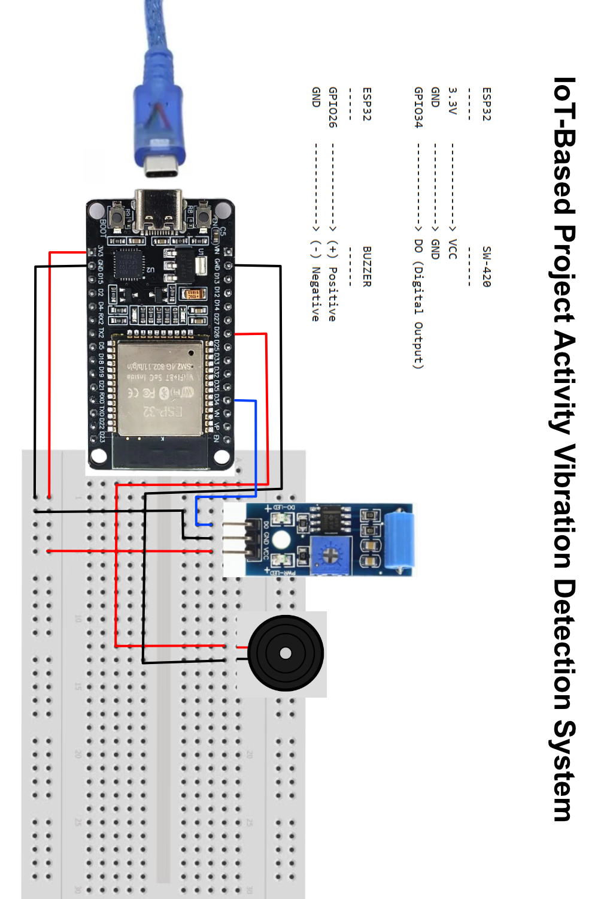
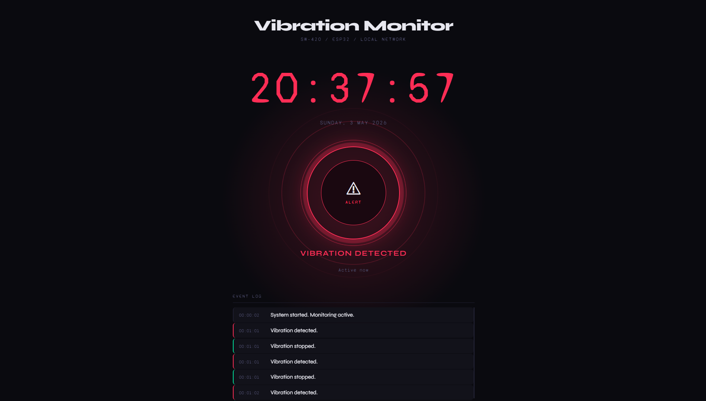

# IoT-Based Project Activity Vibration Detection System
### Using SW-420 Sensor and Buzzer with Local Web Interface Monitoring

---

## Project Description

This system utilizes an **ESP32** as the main microcontroller connected to an **SW-420 vibration sensor** to detect vibrations. When a vibration is detected, a **buzzer** sounds as a local alarm, and simultaneously the system logs the event to a **local web interface** accessible from any device on the same network. The web interface displays real-time vibration status, uptime, and an event log.

---

## Required Components

| No | Component | Description |
|----|-----------|-------------|
| 1 | ESP32 | Main microcontroller with built-in WiFi |
| 2 | SW-420 Vibration Sensor | Detects vibration/tremors |
| 3 | Buzzer | Audible alarm when vibration is detected |
| 4 | Jumper Wires | Connections between components |
| 5 | Adapter & USB Cable | Power supply and program upload |

---

## Wiring / Circuit

### Wiring Diagram



### Connection Diagram

```
ESP32                  SW-420
-----                  ------
3.3V    ------------> VCC
GND     ------------> GND
GPIO34  ------------> DO (Digital Output)


ESP32                  BUZZER
-----                  ------
GPIO26  ------------> (+) Positive
GND     ------------> (-) Negative
```

### Detailed Pin Table

| Component | Component Pin | ESP32 Pin |
|-----------|--------------|-----------|
| SW-420 | VCC | 3.3V |
| SW-420 | GND | GND |
| SW-420 | DO | GPIO34 |
| Buzzer | (+) | GPIO26 |
| Buzzer | (-) | GND |

> **Note:** The SW-420 sensor uses **active LOW** logic — the output will be LOW (0) when **no vibration** is present, and HIGH (1) when **vibration is detected**. Make sure this configuration matches the SW-420 module you are using, as some modules may have inverted logic.

---

## Software Setup

### 1. Install Arduino IDE

- Download: [https://www.arduino.cc/en/software/](https://www.arduino.cc/en/software/)
- Download & Install Tutorial: [https://youtu.be/lTKvZRfJRgw](https://youtu.be/lTKvZRfJRgw)

---

### 2. Install CH340 Driver for ESP32

- Download & Install Tutorial: [https://youtu.be/ctuudlz-d0Q](https://youtu.be/ctuudlz-d0Q)

> **Note:** The CH340 driver is required so your computer can recognize the ESP32 when connected via USB. Follow the tutorial above for the correct installation steps for your operating system.

---

### 3. Install ESP32 Board in Arduino IDE

- ESP32 Board Install Tutorial: [https://drive.google.com/file/d/1pb8Wt_b7EgaFoNqN1fqX-U0KogYZ6rVh/view?usp=sharing](https://drive.google.com/file/d/1pb8Wt_b7EgaFoNqN1fqX-U0KogYZ6rVh/view?usp=sharing)

> **Note:** Installing the ESP32 board in Arduino IDE may take a bit longer than usual. Please be patient and wait for the process to complete fully.

---

## Required Libraries

Install the following libraries via the Arduino IDE **Library Manager** (`Sketch > Include Library > Manage Libraries`):

| Library | Description |
|---------|-------------|
| `WiFi` | Already bundled with the ESP32 board, no need to reinstall |
| `WebServer` | Already bundled with the ESP32 board, no need to reinstall |

No additional external libraries are required for this version.

---

## Program Code

Create a new project in Arduino IDE (`File > New`), then paste the following code:

```cpp
#include <WiFi.h>
#include <WebServer.h>

// =============================================
// CONFIGURATION
// =============================================
const char* ssid     = "YOUR_WIFI_NAME";       // Replace with your WiFi SSID
const char* password = "YOUR_WIFI_PASSWORD";   // Replace with your WiFi password

// =============================================
// PIN CONFIGURATION
// =============================================
#define PIN_SENSOR  34
#define PIN_BUZZER  26

// =============================================
// VARIABLES
// =============================================
WebServer server(80);

bool vibrationActive = false;
unsigned long lastVibrationTime = 0;

// Event log: timestamp + state
struct LogEntry {
  unsigned long ts;  // millis()
  String        msg;
};

LogEntry eventLog[20];
int logIndex = 0;

void addLog(String msg) {
  eventLog[logIndex % 20] = { millis(), msg };
  logIndex++;
}

// =============================================
// JSON API  /api/data
// =============================================
void handleApiData() {
  unsigned long now = millis();
  unsigned long secSince = vibrationActive ? 0 : (now - lastVibrationTime) / 1000;

  String json = "{";
  json += "\"vibrating\":" + String(vibrationActive ? "true" : "false") + ",";
  json += "\"uptime\":" + String(now / 1000) + ",";
  json += "\"last_vib_ago\":" + String(vibrationActive ? 0 : secSince) + ",";
  json += "\"log\":[";
  int total = logIndex < 20 ? logIndex : 20;
  for (int i = total - 1; i >= 0; i--) {
    int idx = (logIndex - 1 - i + 20) % 20;
    if (logIndex > 20) idx = (logIndex - 1 - i + 20) % 20;
    if (i < total - 1) json += ",";
    json += "{\"t\":" + String(eventLog[idx].ts / 1000) + ",\"m\":\"" + eventLog[idx].msg + "\"}";
  }
  json += "]}";

  server.sendHeader("Access-Control-Allow-Origin", "*");
  server.send(200, "application/json", json);
}

// =============================================
// HTML PAGE
// =============================================
void handleRoot() {
  String html = R"rawhtml(
<!DOCTYPE html>
<html lang="en">
<head>
<meta charset="UTF-8">
<meta name="viewport" content="width=device-width,initial-scale=1">
<title>Vibration Monitor</title>
<link rel="preconnect" href="https://fonts.googleapis.com">
<link href="https://fonts.googleapis.com/css2?family=Syne:wght@400;700;800&family=Syne+Mono&display=swap" rel="stylesheet">
<style>
:root {
  --bg:       #0a0a0f;
  --surface:  #12121a;
  --border:   #1e1e2e;
  --text:     #e8e8f0;
  --muted:    #4a4a6a;
  --idle-c:   #2a2a40;
  --vib-c:    #ff2d55;
  --vib-glow: rgba(255,45,85,0.35);
  --ok-c:     #00e5a0;
  --ok-glow:  rgba(0,229,160,0.2);
  --sans: 'Syne', sans-serif;
  --mono: 'Syne Mono', monospace;
}
*, *::before, *::after { box-sizing: border-box; margin: 0; padding: 0; }

body {
  background: var(--bg);
  color: var(--text);
  font-family: var(--sans);
  min-height: 100vh;
  display: flex;
  flex-direction: column;
  align-items: center;
  padding: 36px 20px 48px;
  overflow-x: hidden;
}

/* Ambient background pulse */
body::before {
  content: '';
  position: fixed;
  top: 50%; left: 50%;
  transform: translate(-50%,-50%);
  width: 600px; height: 600px;
  border-radius: 50%;
  background: radial-gradient(circle, var(--idle-c) 0%, transparent 70%);
  transition: background 0.6s;
  pointer-events: none;
  z-index: 0;
}
body.vib::before {
  background: radial-gradient(circle, var(--vib-glow) 0%, transparent 70%);
  animation: bgpulse 0.5s ease-in-out infinite alternate;
}
@keyframes bgpulse {
  from { opacity: 0.6; transform: translate(-50%,-50%) scale(0.95); }
  to   { opacity: 1.0; transform: translate(-50%,-50%) scale(1.05); }
}

/* ---- Header ---- */
header {
  position: relative; z-index: 1;
  text-align: center;
  margin-bottom: 40px;
}
header h1 {
  font-size: clamp(1.4rem, 4vw, 2rem);
  font-weight: 800;
  letter-spacing: -0.02em;
  color: var(--text);
}
header .sub {
  font-family: var(--mono);
  font-size: 0.65rem;
  color: var(--muted);
  letter-spacing: 0.18em;
  text-transform: uppercase;
  margin-top: 4px;
}

/* ---- Clock ---- */
.clock-block {
  position: relative; z-index: 1;
  font-family: var(--mono);
  font-size: clamp(3rem, 12vw, 6rem);
  font-weight: 400;
  letter-spacing: 0.04em;
  color: var(--text);
  text-align: center;
  margin-bottom: 10px;
  transition: color 0.4s;
}
body.vib .clock-block { color: var(--vib-c); }

.date-block {
  position: relative; z-index: 1;
  font-family: var(--mono);
  font-size: 0.75rem;
  color: var(--muted);
  text-align: center;
  letter-spacing: 0.12em;
  text-transform: uppercase;
  margin-bottom: 44px;
}

/* ---- Main indicator ---- */
.indicator-wrap {
  position: relative; z-index: 1;
  display: flex;
  flex-direction: column;
  align-items: center;
  gap: 20px;
  margin-bottom: 44px;
}

.ring-outer {
  position: relative;
  width: 200px; height: 200px;
  display: flex; align-items: center; justify-content: center;
}

/* Idle ring */
.ring-outer::before {
  content: '';
  position: absolute;
  inset: 0; border-radius: 50%;
  border: 2px solid var(--border);
  transition: border-color 0.4s, box-shadow 0.4s;
}
body.vib .ring-outer::before {
  border-color: var(--vib-c);
  box-shadow: 0 0 0 6px var(--vib-glow), 0 0 40px var(--vib-glow);
  animation: ringpulse 0.6s ease-in-out infinite alternate;
}
body.ok .ring-outer::before {
  border-color: var(--ok-c);
  box-shadow: 0 0 0 4px var(--ok-glow);
}
@keyframes ringpulse {
  from { box-shadow: 0 0 0 4px var(--vib-glow), 0 0 30px var(--vib-glow); }
  to   { box-shadow: 0 0 0 14px rgba(255,45,85,0.12), 0 0 60px var(--vib-glow); }
}

/* Ripple rings */
.ripple {
  position: absolute; inset: 0;
  border-radius: 50%;
  border: 1px solid var(--vib-c);
  opacity: 0;
  animation: none;
}
body.vib .ripple:nth-child(1) { animation: ripple 1.2s ease-out 0.0s infinite; }
body.vib .ripple:nth-child(2) { animation: ripple 1.2s ease-out 0.4s infinite; }
body.vib .ripple:nth-child(3) { animation: ripple 1.2s ease-out 0.8s infinite; }
@keyframes ripple {
  0%   { transform: scale(1);   opacity: 0.6; }
  100% { transform: scale(1.9); opacity: 0;   }
}

.indicator-inner {
  position: relative; z-index: 2;
  width: 140px; height: 140px;
  border-radius: 50%;
  background: var(--surface);
  border: 1px solid var(--border);
  display: flex; flex-direction: column;
  align-items: center; justify-content: center;
  gap: 6px;
  transition: background 0.4s, border-color 0.4s;
}
body.vib .indicator-inner {
  background: #1a0810;
  border-color: var(--vib-c);
}
body.ok .indicator-inner {
  background: #081a12;
  border-color: var(--ok-c);
}

.indicator-icon {
  font-size: 2.2rem;
  line-height: 1;
  transition: none;
}

.indicator-label {
  font-family: var(--mono);
  font-size: 0.6rem;
  letter-spacing: 0.18em;
  text-transform: uppercase;
  color: var(--muted);
  transition: color 0.4s;
}
body.vib .indicator-label { color: var(--vib-c); }
body.ok  .indicator-label { color: var(--ok-c);  }

/* Status text */
.status-text {
  font-size: 1rem;
  font-weight: 700;
  letter-spacing: 0.08em;
  text-transform: uppercase;
  color: var(--muted);
  transition: color 0.4s;
}
body.vib .status-text { color: var(--vib-c); }
body.ok  .status-text { color: var(--ok-c);  }

.last-event {
  font-family: var(--mono);
  font-size: 0.65rem;
  color: var(--muted);
  letter-spacing: 0.08em;
}

/* ---- Log ---- */
.log-section {
  position: relative; z-index: 1;
  width: 100%; max-width: 520px;
}
.log-label {
  font-family: var(--mono);
  font-size: 0.6rem;
  letter-spacing: 0.18em;
  text-transform: uppercase;
  color: var(--muted);
  margin-bottom: 10px;
  padding-bottom: 8px;
  border-bottom: 1px solid var(--border);
}
.log-box {
  display: flex;
  flex-direction: column;
  gap: 1px;
  max-height: 280px;
  overflow-y: auto;
}
.log-box::-webkit-scrollbar { width: 3px; }
.log-box::-webkit-scrollbar-track { background: transparent; }
.log-box::-webkit-scrollbar-thumb { background: var(--border); border-radius: 3px; }

.log-entry {
  display: flex;
  align-items: baseline;
  gap: 12px;
  padding: 9px 12px;
  border-radius: 6px;
  background: var(--surface);
  border-left: 2px solid var(--border);
  transition: border-color 0.3s;
  animation: slideIn 0.3s ease-out;
}
@keyframes slideIn {
  from { opacity: 0; transform: translateX(-10px); }
  to   { opacity: 1; transform: translateX(0); }
}
.log-entry.vib-entry  { border-left-color: var(--vib-c); }
.log-entry.stop-entry { border-left-color: var(--ok-c);  }

.log-ts {
  font-family: var(--mono);
  font-size: 0.62rem;
  color: var(--muted);
  flex-shrink: 0;
  min-width: 56px;
}
.log-msg {
  font-size: 0.75rem;
  color: var(--text);
}

footer {
  position: relative; z-index: 1;
  margin-top: 40px;
  font-family: var(--mono);
  font-size: 0.58rem;
  color: var(--border);
  letter-spacing: 0.14em;
  text-transform: uppercase;
}
</style>
</head>
<body id="body">

<header>
  <h1>Vibration Monitor</h1>
  <div class="sub">SW-420 / ESP32 / Local Network</div>
</header>

<!-- Live clock -->
<div class="clock-block" id="clk">--:--:--</div>
<div class="date-block"  id="dt">---</div>

<!-- Main indicator -->
<div class="indicator-wrap">
  <div class="ring-outer">
    <div class="ripple"></div>
    <div class="ripple"></div>
    <div class="ripple"></div>
    <div class="indicator-inner">
      <div class="indicator-icon" id="icon">&#9675;</div>
      <div class="indicator-label" id="ilabel">Standby</div>
    </div>
  </div>
  <div class="status-text" id="statusTxt">No Vibration</div>
  <div class="last-event"  id="lastEvt">--</div>
</div>

<!-- Event log -->
<div class="log-section">
  <div class="log-label">Event Log</div>
  <div class="log-box" id="logBox">
    <div style="font-size:0.72rem;color:var(--muted);padding:10px 12px">No events recorded.</div>
  </div>
</div>

<footer>ESP32 &mdash; Vibration Detection System &mdash; Local Network Interface</footer>

<script>
// ---- Clock & Date ----
const DAYS   = ['Sunday','Monday','Tuesday','Wednesday','Thursday','Friday','Saturday'];
const MONTHS = ['Jan','Feb','Mar','Apr','May','Jun','Jul','Aug','Sep','Oct','Nov','Dec'];
function tick() {
  const d = new Date(), p = n => String(n).padStart(2,'0');
  document.getElementById('clk').textContent =
    p(d.getHours()) + ':' + p(d.getMinutes()) + ':' + p(d.getSeconds());
  document.getElementById('dt').textContent =
    DAYS[d.getDay()] + ', ' + d.getDate() + ' ' + MONTHS[d.getMonth()] + ' ' + d.getFullYear();
}
tick(); setInterval(tick, 1000);

// ---- Format uptime seconds to HH:MM:SS ----
function fmtUptime(s) {
  const h = Math.floor(s/3600), m = Math.floor((s%3600)/60), ss = s%60;
  const p = n => String(n).padStart(2,'0');
  return p(h)+':'+p(m)+':'+p(ss);
}

// ---- State update ----
let lastVib = false;

function updateUI(data) {
  const body = document.getElementById('body');
  const vib  = data.vibrating;

  // Body class
  body.className = vib ? 'vib' : (lastVib ? 'ok' : '');

  // Icon + label
  document.getElementById('icon').textContent     = vib ? '\u26A0' : '\u25CB';
  document.getElementById('ilabel').textContent   = vib ? 'Alert'  : 'Standby';
  document.getElementById('statusTxt').textContent= vib ? 'Vibration Detected' : 'No Vibration';

  // Last event line
  const le = document.getElementById('lastEvt');
  if (vib) {
    le.textContent = 'Active now';
  } else if (data.last_vib_ago > 0) {
    le.textContent = 'Last event: ' + data.last_vib_ago + 's ago  (uptime ' + fmtUptime(data.uptime) + ')';
  } else {
    le.textContent = 'Uptime: ' + fmtUptime(data.uptime);
  }

  // Clear ok class after 4s
  if (!vib && lastVib) {
    setTimeout(() => { if (!lastVib) body.className = ''; }, 4000);
  }
  lastVib = vib;

  // Log
  if (data.log && data.log.length > 0) {
    const box = document.getElementById('logBox');
    box.innerHTML = data.log.map(e => {
      const isVib  = e.m.toLowerCase().includes('detected');
      const isStop = e.m.toLowerCase().includes('stopped');
      const cls    = isVib ? 'vib-entry' : (isStop ? 'stop-entry' : '');
      return `<div class="log-entry ${cls}">
        <span class="log-ts">${fmtUptime(e.t)}</span>
        <span class="log-msg">${e.m}</span>
      </div>`;
    }).join('');
  }
}

async function poll() {
  try {
    const r = await fetch('/api/data');
    const d = await r.json();
    updateUI(d);
  } catch(e) { console.warn('poll error', e); }
}

poll();
setInterval(poll, 800);
</script>
</body>
</html>
)rawhtml";

  server.send(200, "text/html", html);
}

void handleNotFound() {
  server.send(404, "text/plain", "404 Not Found");
}

// =============================================
// SETUP
// =============================================
void setup() {
  Serial.begin(115200);

  pinMode(PIN_SENSOR, INPUT);
  pinMode(PIN_BUZZER, OUTPUT);
  digitalWrite(PIN_BUZZER, LOW);

  Serial.print("Connecting to WiFi");
  WiFi.begin(ssid, password);
  while (WiFi.status() != WL_CONNECTED) {
    delay(500);
    Serial.print(".");
  }
  Serial.println("\nWiFi Connected!");
  Serial.print("IP Address: ");
  Serial.println(WiFi.localIP());

  server.on("/",         handleRoot);
  server.on("/api/data", handleApiData);
  server.onNotFound(handleNotFound);

  server.begin();
  Serial.println("Web server started.");
  addLog("System started. Monitoring active.");
}

// =============================================
// LOOP
// =============================================
void loop() {
  server.handleClient();

  int sensorValue = digitalRead(PIN_SENSOR);

  // SW-420: HIGH = vibration detected
  if (sensorValue == HIGH) {
    digitalWrite(PIN_BUZZER, HIGH);
    if (!vibrationActive) {
      vibrationActive = true;
      lastVibrationTime = millis();
      addLog("Vibration detected.");
      Serial.println("Vibration detected.");
    }
  } else {
    if (vibrationActive) {
      digitalWrite(PIN_BUZZER, LOW);
      vibrationActive = false;
      lastVibrationTime = millis();
      addLog("Vibration stopped.");
      Serial.println("Vibration stopped.");
    }
  }

  delay(100);
}
```

> **Before uploading, make sure you have replaced:**
> - `YOUR_WIFI_NAME` with your WiFi SSID
> - `YOUR_WIFI_PASSWORD` with your WiFi password

---

## How to Upload the Program to ESP32

1. **Make sure the ESP32 is connected** to your laptop/PC via USB cable.

2. **Configure the Board:**
   - Click the **Tools** menu in Arduino IDE
   - Go to **Board** → **esp32** → select **ESP32 Dev Module**

3. **Configure the Port:**
   - Click the **Tools** menu again
   - Go to **Port**
   - Select the port connected to the ESP32 (e.g., `COM8` on Windows, `/dev/ttyUSB0` on Linux/Mac)

4. **Upload the Program:**
   - Press **Ctrl+U** to start the upload

---

### Upload Troubleshooting

| Problem | Solution |
|---------|----------|
| Upload fails | The selected Port may be wrong. Try selecting a different available port. |
| Still fails after changing port | Press **Ctrl+U** and **hold the BOOT button** on the ESP32 simultaneously. The ESP32 usually requires this on the first program upload. |
| Still failing | Read the error message in the Arduino IDE **Output** window for further guidance. |

---

## Accessing the Web Interface

The ESP32 runs a local web server that can be accessed from any browser on the same network.

### Web Interface Preview



### Steps to Open the Web Interface

1. **Make sure your device (phone, laptop, or PC) is connected to the same WiFi network or hotspot as the ESP32.**
   - The ESP32 only communicates over the local network. If your device is on a different network, the web page will not load.
   - Use a 2.4 GHz WiFi network (ESP32 does not support 5 GHz).
   - If using a mobile hotspot, make sure mobile data is active and both the ESP32 and your device are connected to that hotspot.

2. **After uploading the program, open the Serial Monitor in Arduino IDE:**
   - Go to **Tools** → **Serial Monitor**
   - Set the baud rate to **115200**
   - Wait until you see the message `WiFi Connected!` followed by a line showing the IP address, for example:
     ```
     IP Address: 192.168.1.105
     ```

3. **Open a web browser** on your device (Chrome, Firefox, Safari, or any browser).

4. **Type the IP address** shown in the Serial Monitor into the browser address bar, for example:
   ```
   http://192.168.1.105
   ```

5. The **Vibration Monitor** web interface will load, showing:
   - Real-time vibration status (active or no vibration)
   - A live clock and uptime counter
   - An event log of all detected and stopped vibration events

> **Note:** The IP address may change if the ESP32 reconnects to the network. Always check the Serial Monitor for the latest IP address if the page does not load.

---

## How the System Works

```
[SW-420 Sensor]
      |
      | (Digital signal HIGH when vibration occurs)
      |
      v
[ESP32]
      |
      |-- Activate BUZZER (local alarm)
      |
      |-- Update event log
      |
      |-- Serve data via local web server
      |
      v
[Browser on same network] --> http://<ESP32_IP_ADDRESS>
```

### Communication Flow

1. **ESP32 connects to WiFi** — the ESP32 uses its built-in WiFi to join the local network.

2. **Web server starts** — the ESP32 hosts a web server on port 80, accessible at its local IP address.

3. **Browser polls `/api/data`** — the web page automatically fetches the latest sensor status every 800 milliseconds, keeping the display updated in real time without requiring a manual page refresh.

4. **Vibration event logic:**
   - When vibration is **first detected** → buzzer activates, event is logged, web interface updates immediately
   - While vibration **continues** → buzzer stays on, status remains active
   - When vibration **stops** → buzzer turns off, a stop event is logged, web interface updates to idle state

### Network Requirements

- The ESP32 and the viewing device must be on the **same WiFi network or hotspot**.
- Use a **2.4 GHz** WiFi network (ESP32 does not support 5 GHz).
- If using a mobile hotspot, ensure mobile data is active and stable.
- The web interface is accessible from any device with a browser: phone, tablet, or laptop.

---

## Project Structure

```
Vibration-Detection-System/
|
|-- README.md                    <- This documentation
|-- img/
|   |-- Image_3.jpg              <- Wiring diagram
|   `-- web_vibration.png        <- Web interface screenshot
`-- vibration_detection/
    `-- vibration_detection.ino  <- Arduino program code
```

---

## References and Important Links

| Source | Link |
|--------|------|
| Arduino IDE | https://www.arduino.cc/en/software/ |
| Arduino IDE Install Tutorial | https://youtu.be/lTKvZRfJRgw |
| CH340 Driver Install Tutorial | https://youtu.be/ctuudlz-d0Q |
| ESP32 Board Install Tutorial | https://drive.google.com/file/d/1pb8Wt_b7EgaFoNqN1fqX-U0KogYZ6rVh/view?usp=sharing |

---

> Created for IoT-based project monitoring using ESP32, SW-420 Vibration Sensor, and a local web interface accessible over WiFi.
